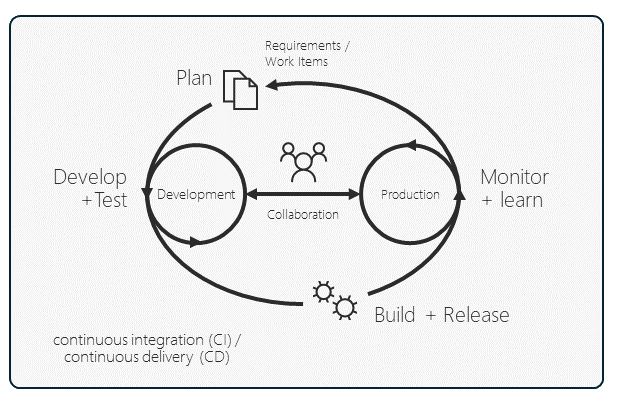
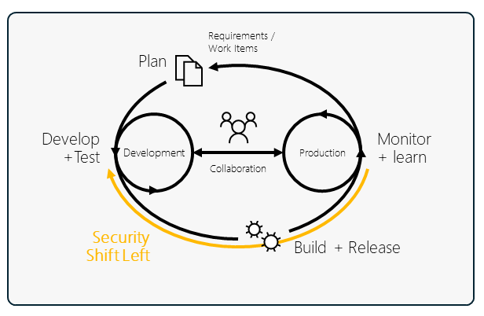

# Why Platform Engineering 

 ## Unlock business value 

For organisations to survive and thrive in this new era, they must embrace digital transformation.  The rate of innovation is getting faster and this poses a formidable challenge, intensifying competition for all. To stay ahead, businesses must leverage the power of software technology to innovate, differentiate, and disrupt.

Strategic investment in applications capable of driving innovation and providing a competitive edge is paramount for ensuring resilience and fostering growth. Consequently, there is an urgent need for swift application deployment to unlock business value promptly. 

By streamlining application development and deployment processes, Platform Engineering enables organizations to address the urgent need for agility and efficiency, expediting innovation cycles and sustaining a competitive edge.

But didnt DevOps solve this problem ?  Why do we need something new?

## Before DevOps

So before DevOps, developers and operations folks were siloed with a metaphorical wall between.  The two teams didn't talk much, they had their own territories.

Developers would build their cool apps and then just toss them over this imaginary wall to the operations team, like, "Here you go, deploy this!".  If it worked in the developers enviuronments, they assumed it would work smoothly everywhere, even in production.

And did the operations team really understand what these apps were all about? Could they make sense of all the logs/instrumention these apps spat out? Probably not. So often chaos often ensued.

## DevOps 

DevOps knocked down the wall and brought developers and operations into the same team, enabling organizations to develop, deploy, and improve products at a faster pace than they could with traditional software development approaches.

One definition of DevOps is: "The union of people, process, and products to enable the continuous delivery of value." The important thing highlighted here is that DevOps is not just a product; it requires a culture of collaboration that is critical for its success.

In DevOps, we often discuss the inner and outer loop. The inner loop is the iterative process that a developer performs when they write, build, test and debug code.  The outer loop involves the build, deploy, monitoring, and subsequent development planning, including application health and performance monitoring.

In a DevOps world, there is now a single team responsible for everything about the app: both the inner and outer loops. In some cases, the previous different job roles have been replaced, and everyone is now considered a software engineer. Delivering value to the business is now a team goal, and if things go wrong, it's a team problem.

## DevSecOps

DevSecOps is the evolution of DevOps. It focuses on integrating security practices within the DevOps inner and outer loops to create a security-first culture.

Furthermore, it mandates a shift-left mentality – that is, addressing security in the earliest stages of the development lifecycle. So, not only is the software team thinking about building a high-quality product efficiently, but they are also implementing security measures as they progress.

Addressing security earlier will improve robustness, save costs, and accelerate delivery.

## So whats the problem ?

As discussed above, combining developers and operations into unified teams offers numerous advantages such as expedited applications delivery and enhanced collaboration. Nonetheless, issues arise within large enterprises tasked with supporting large numbers of applications.  A typical enterprise organisation could have hundreds of applications. 

Scaling out DevOps teams across an enterprise to manage applications presents significant challenges, including inefficiencies and duplicated efforts stemming from each team's isolation. Without adequate coordination, teams may inadvertently replicate tasks, or solve problems already addressed by others, so wasting valuable time and resources.

Having skills siloed within teams can result in a lack of appropriate expertise in other teams, potentially leading to poor decisions, operational issues, and setbacks in project progression. The separation of skills can also hamper knowledge sharing and stifle the exchange of innovative ideas.

Furthermore, the absence of centralized coordination or standardization yields inconsistency and inefficiency. For example, the use of different tech stacks and different patterns & practices.

These factors collectively impede our primary objective: to expedite the delivery of business value.

## So whats the solution ?

The proposed solution is Platform engineering and the Internal Developer Platform .

