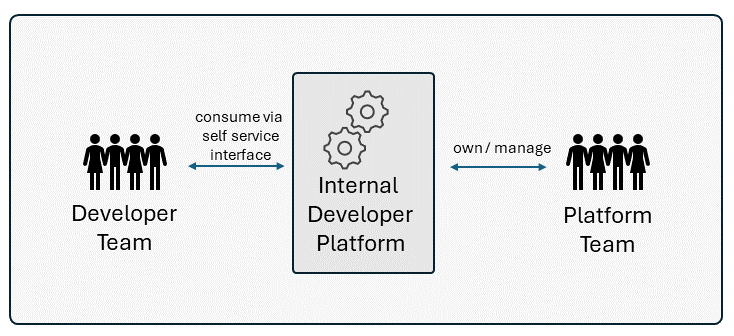

# Empowering Developers

Platform Engineering and Internal Developer Platform (IDP) are two related concepts within the realm of software development and operations. While they share some similarities, they also have distinct focuses and purposes.

## Platform Engineering

Platform Engineering focuses on building and maintaining the foundational infrastructure and services that support the entire organization's software development and deployment processes. Key features of Platform Engineering include:

- **Infrastructure Management**: This involves managing the underlying infrastructure components such as servers, networks, storage, and cloud services.
- **Automation**: Platform engineers develop and maintain automation tools and frameworks to streamline processes like deployment, monitoring, scaling, and provisioning.
- **Scalability and Reliability**: Ensuring that the platform can scale effectively to handle increasing workloads and maintain high availability and reliability.
- **Security**: Implementing security measures and best practices to protect the platform and its associated services from vulnerabilities and threats.
- **Integration**: Integrating various tools and services into the platform ecosystem to support the development lifecycle effectively.

## Internal Developer Platform

An Internal Developer Platform (IDP) is a layer built on top of the underlying platform infrastructure. Its primary purpose is to provide a self-service interface and a set of tools that streamline and automate common development workflows for internal developers. 

Key features of an IDP include:

- **Developer Productivity**: Providing developers with tools and workflows that increase their productivity, such as streamlined deployment pipelines, code review automation, and integrated development environments (IDEs).
- **Standardization and Consistency**: Enforcing best practices and standardization across development teams by providing templates, libraries, and predefined configurations.
- **Collaboration**: Providing collaboration among development teams by providing features such as shared code repositories, issue tracking, and communication tools.
- **Observability**: Providing built-in monitoring, logging, and debugging tools to help developers diagnose and troubleshoot issues more effectively.
- **Governance and Compliance**: Enforcing governance policies and compliance requirements through automated checks and controls integrated into the development workflow.

An IDP consists of many different technologies and tools, integrated in a way that reduces cognitive load on developers without abstracting away context and underlying technologies.  Furthermore It will provide guardrails, guiding developers towards best practices and ensuring compliance.

## Compared 

Platform Engineering encompasses the establishment and upkeep of infrastructure and toolsets essential for facilitating software development throughout an organization.

In contrast, the IDP represents a tailored manifestation of Platform Engineering within an organization. The primary objective of the IDP is to streamline workflows, boost productivity, and reduce cognitive load by consolidating required tools and services within a developer portal.

The platform team is responsible for providing the IDP, with its continuous refinement being driven by developer feedback and evolving organizational needs.  They should deliver the platform with a product mindset and be customer-focused ... in this case the customers are the developers.  

 
 

## Do we need a IDP ?

An IDP isn't appropriate for everyone. There are cases where its implementation are not necessary and probably overkill. 

For smaller organizations or teams working on straightforward projects with simple development processes, the overhead of setting up and maintaining an IDP might outweigh the benefits it offers and introduce unnecessary complexity. Similarly, in situations where developers have highly specialized needs or workflows that aren't easily accommodated by a standardized platform, investing in an IDP may not be the most efficient use of resources.

Organizations must carefully assess their specific requirements and development workflows before deciding whether or not to implement an IDP.