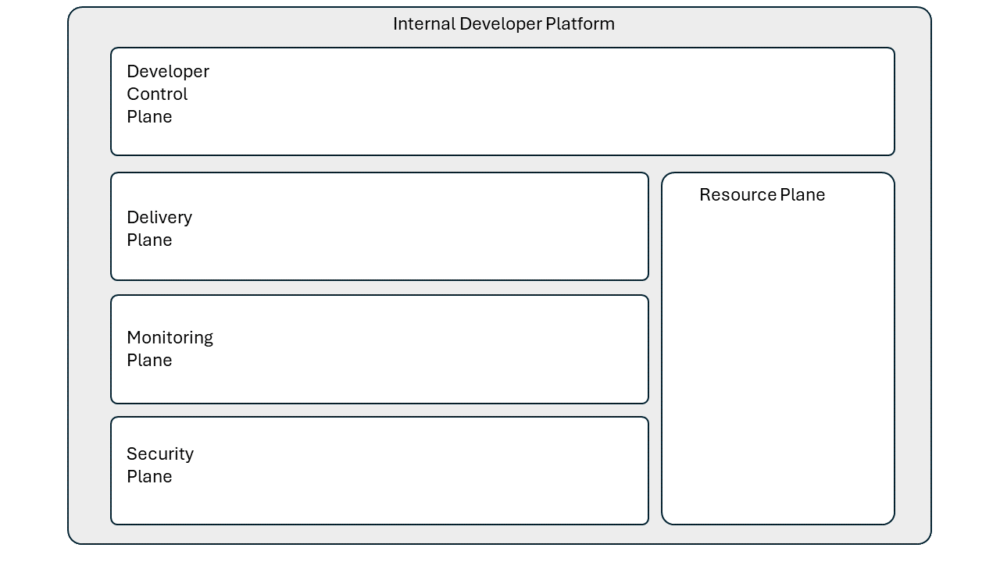

# Platform Tooling

Platform engineering involves creating and managing the foundational infrastructure and tools that enable developers to build, deploy, and operate software applications efficiently and reliably.

## Components & Tooling

This section lists some basic components and tooling typically involved in platform engineering:

-  **Developer Workstations**: Equipping developers with efficient workstations or cloud hosted PCs with necessary development tools and environments ensures productivity and smooth development processes. These usually include integrated development environments (IDEs), code editors, debugging tools, and other resources tailored to the needs of developers.

- **Code Repositories**: Version control systems such as Git provide repositories for storing and managing source code, enabling collaboration, versioning, and change tracking across development teams.

- **Infrastructure as Code (IaC)**: This practice involves specifying infrastructure topology in documents stored in version control, similar to code management. It utilizes DevOps tooling for consistency, quality, and accountability, allowing rapid creation or deletion of infrastructure on demand.

- **Cloud Native and Serverless Runtime Environments**: Leveraging containerization technologies, orchestration platforms, and serverless computing, these environments package, deploy, and manage applications and dependencies consistently across different environments. They enable agility, scalability and resilience plus offer the benefits of pay-per-use pricing models.

- **Automation**: Streamlines repetitive tasks, reduces manual errors, and accelerates software delivery through Continuous Integration/Continuous Deployment (CI/CD) pipelines that automate build, testing, and deployment of code changes for rapid and reliable releases.

- **Monitoring and Observability Tools**: Essential for tracking health, performance, and availability of applications and infrastructure components, with log aggregation tools centralizing and analysing logs for troubleshooting and debugging.

- **Identity and Access Management**: Crucial for managing user access permissions, authentication, and authorization to platform resources.

- **Security Tools and Practices**: Protects the platform against threats and vulnerabilities through encryption mechanisms, access controls, networking security measures, secrets management, and vulnerability scanning tools.

- **Networking Mesh Technologies**: Provide a dedicated infrastructure layer for handling service-to-service communication, including traffic management, security, and observability features.

- **Collaboration/Documentation Tools**: Enable effective communication, knowledge sharing, and collaboration among teams, with comprehensive documentation facilitating onboarding, troubleshooting, and knowledge sharing.

- **Work Item & Issue Tracking**: Organize tasks, prioritize work, and track progress effectively, providing visibility into ongoing activities and facilitating communication between team members.

- **Testing Tools and Practices**: Ensure the quality and reliability of software through comprehensive testing methodologies, including unit testing, integration testing, and end-to-end testing, enabling early detection of bugs and issues.  This encompasses both automated testing, which includes unit tests and integration tests run as part of Continuous Integration (CI) pipelines, as well as manual exploratory testing to uncover unforeseen issues.

## IDP Reference Architecture

McKinsey has introduced an Internal Developer Platform (IDP) reference architecture, which serves as a blueprint for building efficient and standardized internal developer platforms. These platforms empower developers, enhance efficiency, and streamline the software delivery lifecycle. It defines five key planes within the architecture:

- **Developer Control Plane**:  This  acts as the primary configuration layer where application developers interact with the platform. It allows them to configure their workloads, manage code, and publish changes.  
  - Components include:  Developer workstations and tools. code repos / version controls, workload specifications (developers define workload requirements and constraints), developer portal to access services.

- **Delivery Plane**:  This  facilitates seamless transitions from development to deployment. It ensures efficient integration and delivery of software applications.
  - Components include: Automation, continuous integration (build and testing processes), continuous deployment (deployment workflows),  release management, artifact repositories.

- **Monitoring Plane**:  This provides insights into application performance, identify bottlenecks, and troubleshoot issues effectively.
  - Components include: Observability tools: (Monitor application behaviour, metrics, and logs), application performance monitoring, service health monitoring.

- **Security Plane**  This mitigates risks, protect data, and maintain a secure development environment.
  - Components include: Secrets management, access controls, and governance policies.

- **Resource Plane**:  this manages the components necessary to run applications within the platform.
  - Components include: Compute, databases, storage, networking infrastructure, integration services (APIs, messages, events, workflow)

The planes work together to create a robust IDP, enhancing developer productivity and ensuring a reliable platform for software delivery. 
the foundational components and tooling for platform engineering, but specific requirements may vary depending on the organization's needs, infrastructure, and technology stack. Additionally, platform engineers should continuously evaluate and evolve their tooling and practices to adapt to changing requirements and advancements in technology. 
