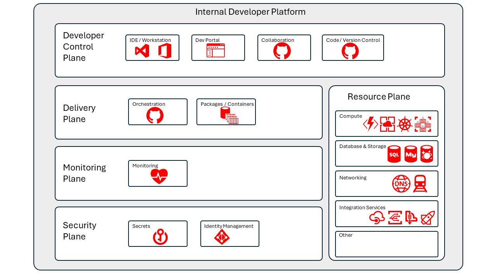

# Microsoft Products & Technologies

Up to now - no products have been mentioned in this document. Remember Platform Engineering is a practice, not a product.

Lets see how the current Microsoft tools and technologies slot into the IDP reference architecture.

## Reference Architecture

 

### Developer Control Plane

- Developer Portal:
  - BackStage [link](<https://backstage.io/>) ... Spotify's open source framework for building developer portals
  - Radius [link](<https://radapp.io/>) ... Azure Incubation project to define/deploy cloud-native applications
  - Microsoft DevCenter [link](<https://learn.microsoft.com/en-us/azure/dev-box/quickstart-configure-dev-box-service#create-a-dev-center>) | Microsoft DevPortal [link](<https://devportal.microsoft.com>)  
  - Azure Deployment Environments [link](https://learn.microsoft.com/azure/deployment-environments/) | Azure Developer CLI [link](https://learn.microsoft.com/azure/developer/azure-developer-cli/) 
- Collaboration & Documentation 
  - Microsoft Office Platform 
    - M365 [link](<https://learn.microsoft.com/microsoft-365/developer/>)
    - Teams [link](<https://learn.microsoft.com/microsoftteams/>)
  - GitHub 
    - Issues [link](<https://docs.github.com/issues>)
    - Projects  [link](<https://docs.github.com/issues/planning-and-tracking-with-projects/learning-about-projects>) 
    - Wikis [link](<https://docs.github.com/en/communities/documenting-your-project-with-wikis/about-wikis>)

### Delivery Plane 

- GitHub - Actions [link](<https://docs.github.com/en/actions>)
- GitHub - Packages, Container Registry [link](<https://docs.github.com/en/packages>)
- Azure Container Registry  [link](<https://learn.microsoft.com/azure/container-registry>)
- Infrastructure as code [link](<https://learn.microsoft.com/azure/cloud-adoption-framework/ready/considerations/infrastructure-as-code>)

### Monitoring Plane 

- Azure Monitor [link](<https://learn.microsoft.com/azure/azure-monitor/overview>)
- Open Telemetry  [link](<https://learn.microsoft.com/azure/azure-monitor/app/opentelemetry-enable>)

### Security Plane  

- Microsoft Entra [link](<https://learn.microsoft.com/entra>)
- Azure Key Vault [link](<https://learn.microsoft.com/azure/key-vault>)

### Resource Plane

This is not an exhaustive list of Azure Resources - check [here](<https://azure1.dev>)

- Azure Compute Runtimes 
  - Azure Container Apps [link](<https://learn.microsoft.com/azure/container-apps>)
  - Azure Kubernetes Service [link](<https://learn.microsoft.com/azure/aks>)
  - Azure App Service [link](<https://learn.microsoft.com/azure/app-service>)
  - Azure Functions [link](<https://learn.microsoft.com/azure/azure-functions>)
- Azure Databases & Storage
  - Azure Storage [link](<https://learn.microsoft.com/azure/storage>)
  - Azure SQL Database [link](<https://learn.microsoft.com/azure/azure-sql/database>)
  - Azure CosmosDB [link](<https://learn.microsoft.com/azure/cosmos-db>)
  - Azure MySQL [link](<https://learn.microsoft.com/azure/mysql>)
- Azure Networking 
  - Azure Virtual Networks [link](<https://learn.microsoft.com/azure/virtual-network>)
- Azure Integration Services 
  - Azure API Management [link](<https://learn.microsoft.com/azure/api-management>)
  - Azure Logic Apps [link](<https://learn.microsoft.com/azure/logic-apps>)
  - Azure Event Grid [link](<https://learn.microsoft.com/azure/event-grid>)
  - Azure Service Bus [link](<https://learn.microsoft.com/azure/service-bus-messaging>)

## Implementation

Whats the Microsoft strategy / solution for the Internal Developer Platform - is there a developer portal / API ?  ... watch this space 😆

If you want to build it yourself now - some guidance is [here](<https://learn.microsoft.com/en-us/platform-engineering/>)