# Azure Developer Platform 

Azure has provided major steps towards platform engineering with the following building blocks:

  - Azure Deployment Environments  
  - Azure Developer CLI  


## Azure Deployment Environments 

[Azure Deployment Environments](https://learn.microsoft.com/azure/deployment-environments/) (ADE)  enables developers to self-serve their own environments from curated infrastructure-as-code (IaC) templates provided by the platform engineering team. This approach ensures consistency across all environments and embeds guardrails such as security, governance and industry best practices.   

### Key Concepts

- **Environment Definition** - this consists of an IaC template paired with an environment file containing additional metadata. Currently, only ARM (Azure Resource Manager) templates are supported, although support for alternatives such as Bicep/Terraform is coming.   An example could be a definition of a web application - and includes both a web site and a database.

- **Project** - this represents a team or business function within the organization.  An example could be the team that is responsible for the web application mentioned above.  The project will include configuration such as identity, subscriptions, access permissions ...

- **Dev Center** - this is a collection of Projects that require similar settings.   A Project can only be associated with one Dev Center.

- **Catalog** - this is a set of curated Environment Definitions and used to make available to Project(s).  An example is here: [Sample Dev Center Catalog](https://github.com/microsoft/devcenter-catalog).   Note that a Catalog is just a Git based repository.

- **Environment Type** - this defines the various environments to which development team can deploy to.  There are actually two types:
  - Dev Center Environment Types - allows naming conventions that conform to what your enterprise uses. Examples could be Development, Staging, Production. 
  - Project Environment Types - are subset of Dev Center Environment Types, and allow additional configuration such as Identity and Access Permissions applied when an environment is deployed.

Platform engineers are responsible for creating/managing Environment Definitions, Environment Types and Projects.  By associating Environment Definitions with specific Projects, they define the resources that can be deployed by the development teams.

Developers can use designated environments to deploy resources for their needs, allowing them to concentrate on coding / software delivery without getting distracted by complexities of the underlying infrastructure.

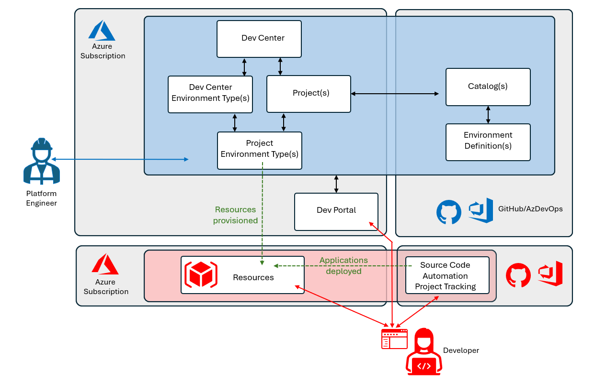

### Developer Portal 

Developers can set up Deployment Environments through the Developer Portal, accessible a [https://devportal.azure.com/](<https://devportal.azure.com/>).  Access to authorized deployments requires authentication with Entra ID.

Another Azure service accessible through the same Developer Portal is Microsoft DevBox.  This is a mechanism for provisioning cloud-based developer PCs — a topic for separate discussion. 

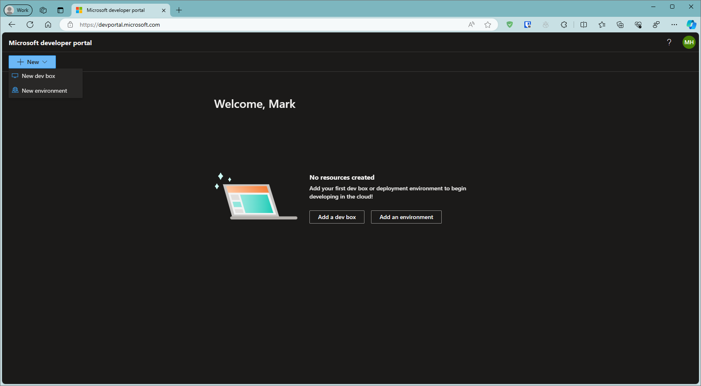

If we selected to add a `New Environment` a list of permitted environments definitions is available for selection. It is also possible to enable an expiry time/date to which the environment will be automatically deleted - this will help with cost management /optimise spending. Depending on what is selected - a subsequent screen may be presented for parameters to be entered.   The developer can then select `Create`.

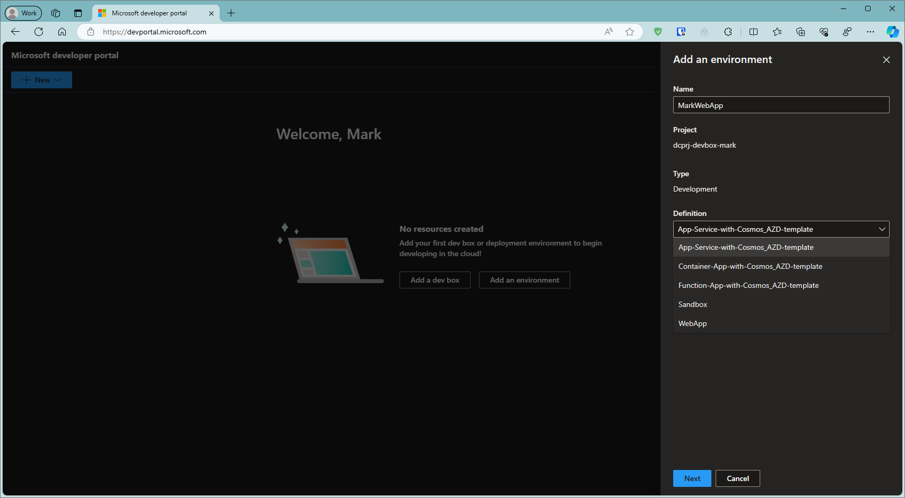

After a period of time, the portal will show the environment as being created. 

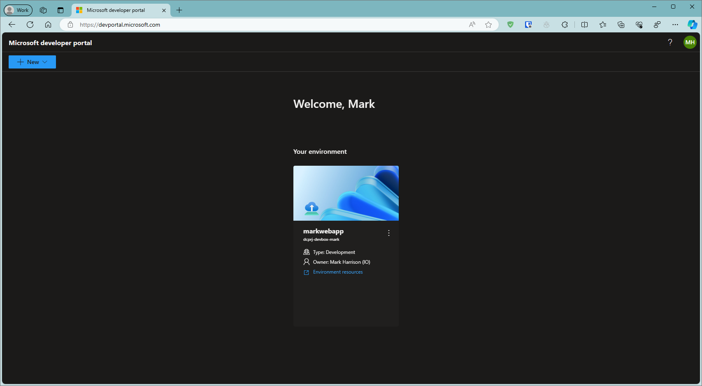

Clicking the link 'Environment resources' will open up the Azure management portal and the provisioned resources - available for the developer - can be seen. 

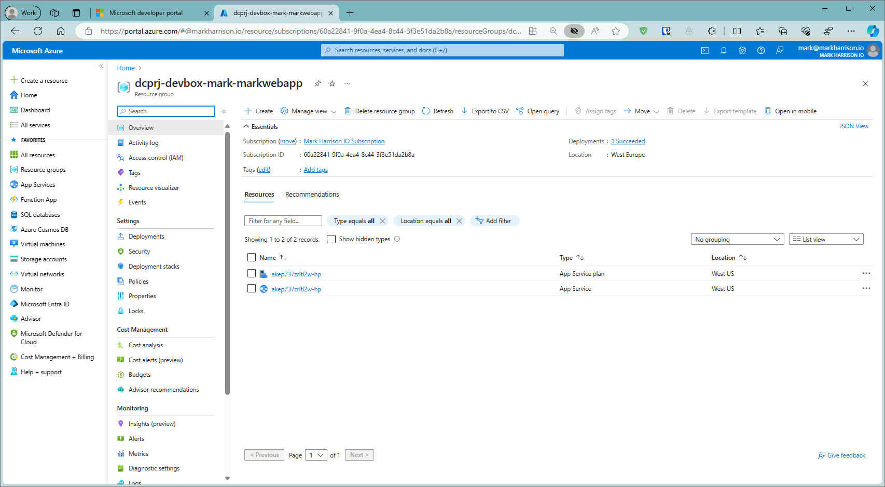 

In the example shown, we have an Azure App Service deployed and ready for the developer to deploy their application - perhaps using automation such as GitHub Actions.  But there is another mechanism - namely the Azure Developer CLI.


## Azure Developer CLI

The [Azure Developer CLI (azd)](<https://learn.microsoft.com/azure/developer/azure-developer-cli/>) is a set of command-line tools designed to streamline the development and deployment of Azure-based applications. It provides developers with a simplified interface to interact with Azure resources, manage deployments, and automate common tasks related to Azure development.

### Key Concepts

azd operates with templates comprising of both IaC assets and application code.   The developer can either:
- create their own template
- build on one shared in a template library found at [https://azure.github.io/awesome-azd/](<https://azure.github.io/awesome-azd/>).

The following section shows how to use azd from the command line.   Similar functionality is accessible directly from within Visual Studio 2022 / Visual Studio Code (needs azd extension).  There is also a GitHub Action that installs azd so that steps in workflow can use it  to provision resource / deploy applications. 

This is the structure of the template library - and what we see when pulled down to disk:

```
├── infra                                        [ Contains infrastructure as code files ]
├── .azdo                                        [ Configures an Azure Pipeline ]
├── .devcontainer                                [ For DevContainer ]
├── .github                                      [ Configures a GitHub workflow ]
├── .vscode                                      [ VS Code workspace configurations ]
├── .azure                                       [ Stores Azure configurations and environment variables ]
├── src                                          [ Contains all of the deployable app source code ]
└── azure.yaml                                   [ Describes the app and type of Azure resources]
```


### Typical Workflow 

To get a list of available templates ...

```
azd template list
```

The default is to list them from the awesome-azd template gallery mentioned earlier.

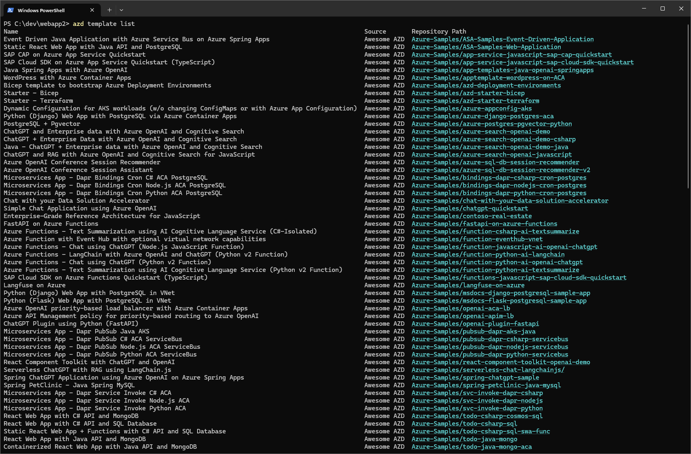

First we must intitialise the project.  We are going to use the template for a React Web App with C# API and SQL Database - normally the sample code would be replaced with the developers own code.  

```
azd init --template todo-csharp-sql
```

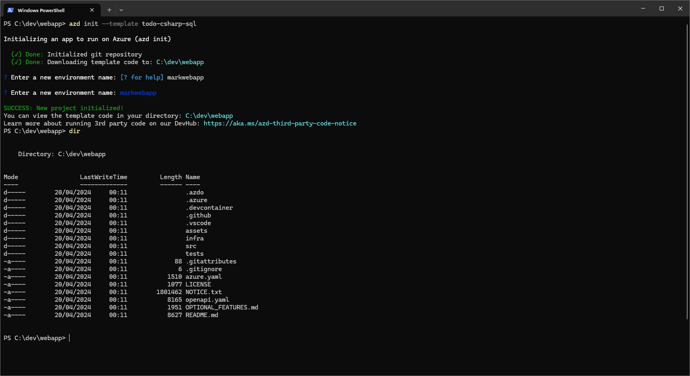

Provision the Azure resources ... 

```
azd provision
```

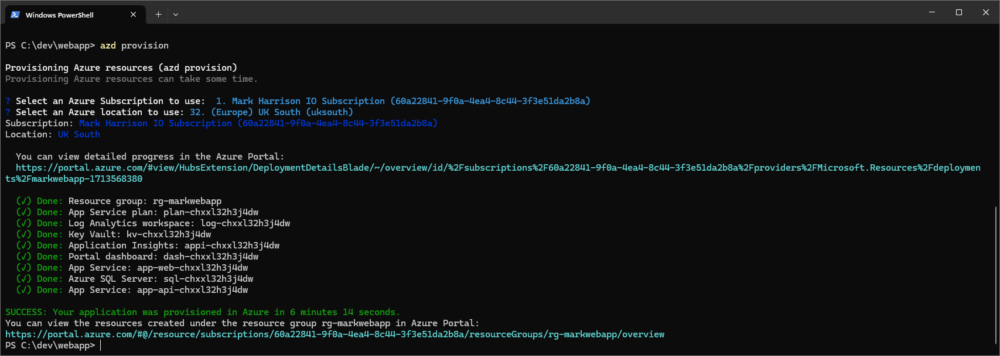

Check in Azure Management portal that the resources exist ... 

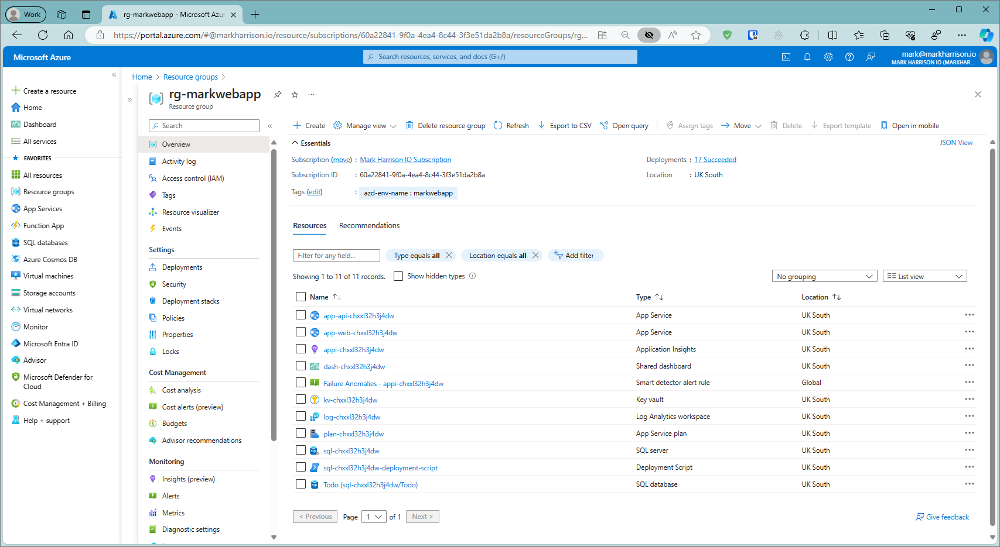 

Next deploy the application ...

```
azd deploy
```

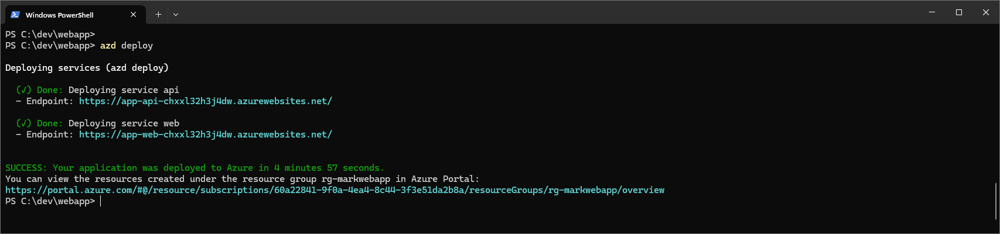

The Application will now be running - we can hit the URLs of the Web App and the APi App ...

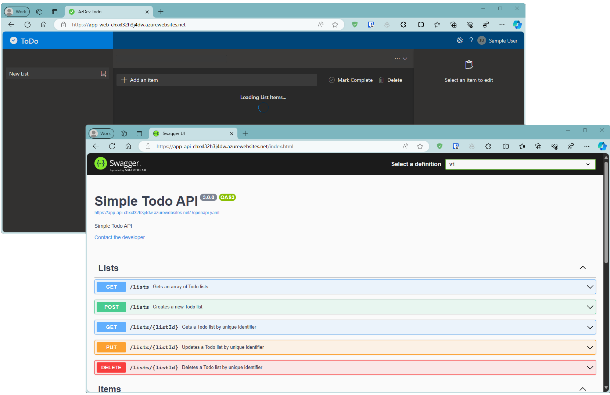

To clean up ...

```
azd down
```

The resources have been deleted.

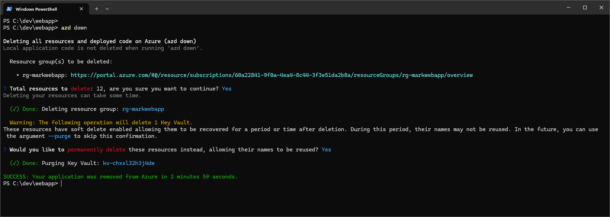


## Using Azure Developer CLI with Azure Deployment Environments

The Azure Developer CLI provides support for Azure Deployment Environments - this is enabled by the following command ... 

```
azd config set platform.type devcenter
```

We can see the list of templates - it is now using those from the Catalog in the Dev Center - and not as previously, from the awesome-azd template gallery ...

```
azd template list
```

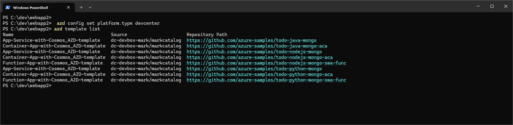


## Summary

In this section, we explored how platform engineers can leverage Azure Deployment Environments to establish self-service infrastructure catalogs embedded with security and governance controls. This approach empowers developers to concentrate on software delivery, thereby maximizing their focus on delivering tangible business value.   


